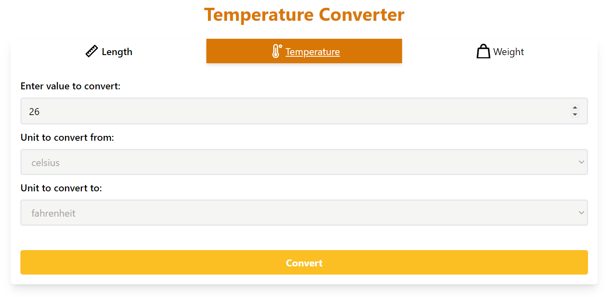
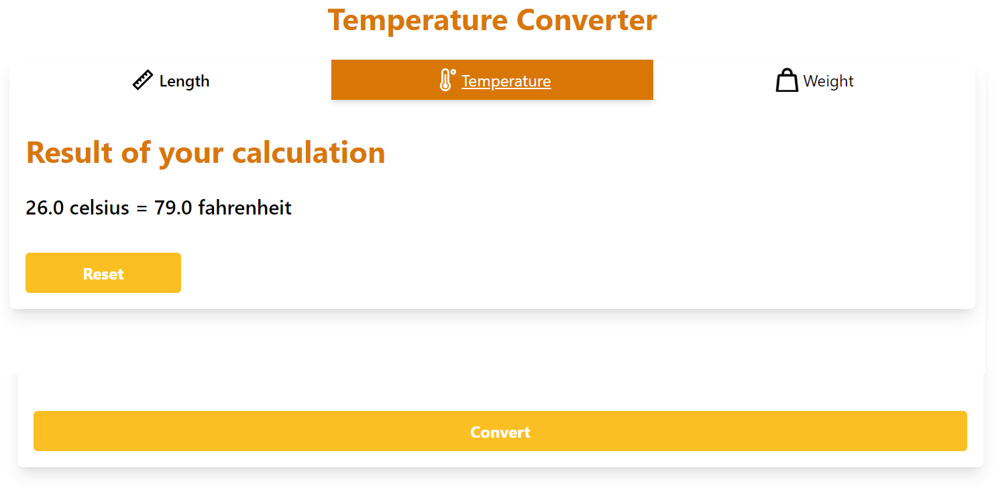

# Unit Converter

##### Solution for the [Unit Converter](https://roadmap.sh/projects/unit-converter) backend project from [roadmap](https://roadmap.sh/).
[](https://roadmap.sh/)

**Description:**

This Spring Boot application provides a user-friendly web interface for converting between various units of measurement. It supports length, weight and temperature.

**Prerequisites:**

-   **Java 11 or above:** Download and install Java from the official website ([https://www.oracle.com/java/technologies/javase-downloads.html](https://www.oracle.com/java/technologies/javase-downloads.html)). Ensure the path to the `java` executable is set in your system's environment variables.

-   **Apache Maven (optional):** For managing dependencies and building the project more efficiently. Download and install Maven from the official website ([https://maven.apache.org/](https://maven.apache.org/)). This guide will provide instructions for both Maven and manual approaches.

**Running the Application:**

**Using Maven:**

1.  Clone or download the project repository.
    ``` bash
    git clone https://github.com/LuisDavidAsmat/number-guessing-game.git
    ```
2. Open a terminal or command prompt and navigate to the project directory
   ``` bash
   cd unit-converter/src
   ```
3.  Run the following command. This will download dependencies and build the project.
    ``` bash
	   mvn clean install
	```
4.  This command will start the application on port 8080 by default (you can access it at http://localhost:8080 in your web browser).
    ``` bash
    mvn spring-boot:run
    ```

**Using the Application:**

1.  Open your web browser and navigate to http://localhost:8080 (or your server's address and port if deployed).
2.  You'll see a page with a form with three categories (length, temperature and weight).
    
3.  Enter the value you want to convert in the appropriate field.
4.  Select the units you want to convert from and to using the dropdown menus.
5.  Click the "Convert" button.
6.  The converted value will be displayed below the form.
    

**Contributions:**

Contributions are welcomed to this project! Feel free to fork the repository, make changes, and submit pull requests.
